 

 

## 🧬 ⟷ 🔌 About me

I study **Molecular Biology & Genetics**, but I spend my free time at a workbench, designing PCBs, soldering, 3D printing enclosures and tuning around the amateur radio bands. I like the place where wet-lab biology meets code and hardware.

 

## 🔭 What I'm into

<table>
  <tr>
    <td width="50%" valign="top">

### 🧬 Biology & Bioinformatics
Molecular biology and genetics at university. Teaching myself to analyse data with code — RNA-seq and transcriptomics with **Python** and the command line.

</td>
    <td width="50%" valign="top">

### 🔌 Electronics
Power circuits, microcontroller gadgets... I like designing the board, not just wiring a module.

</td>
  </tr>
  <tr>
    <td width="50%" valign="top">

### 🖨️ 3D Printing & Design
Modelling enclosures, brackets and mounts, then printing them to fit the boards I design.

</td>
    <td width="50%" valign="top">

### 📻 Amateur Radio
Licensed as **TA7MNA**. QRP, portable operation, and accessories that make the station more fun to use.

</td>
  </tr>
</table>

## 🛠️ Toolbox

  
  
  
  
  
  
  
  
  

